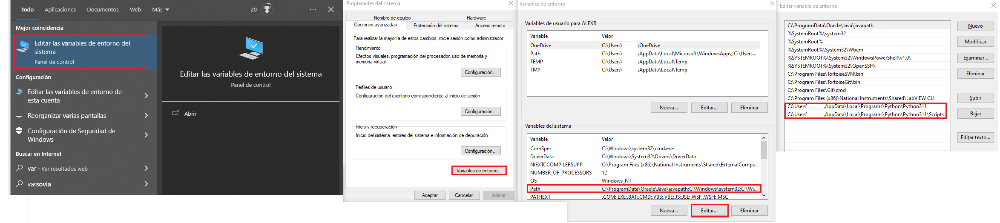
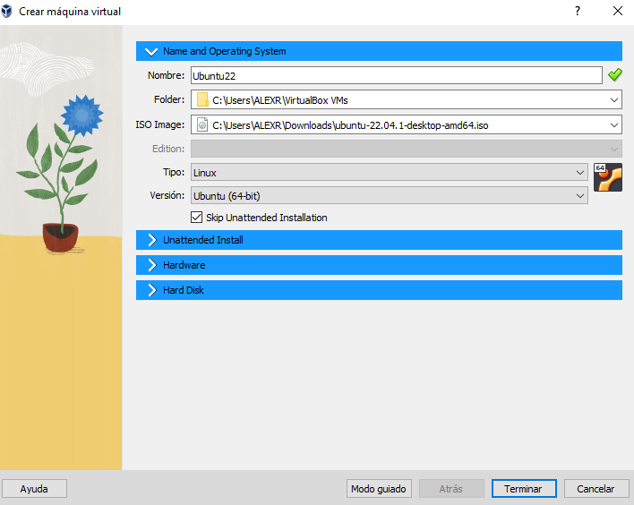
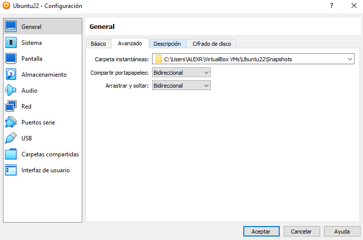
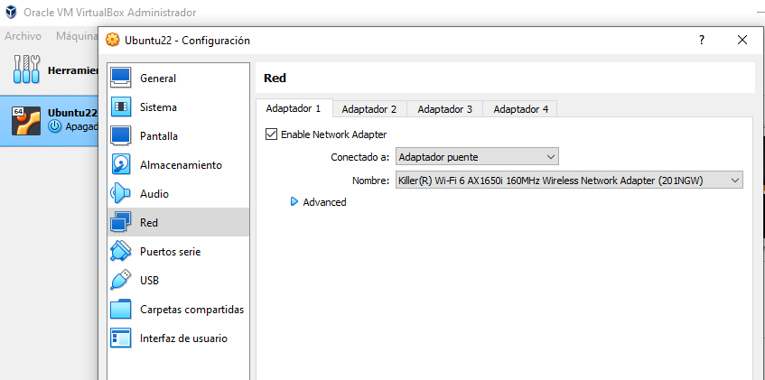

# PythonInstrumentControl
Functions to control laboratory intruments, like Power supplies, multimeters Signal Waveform generators...
<!-- TOC -->

- [Tools Installation](#tools-installation)
    - [VS Code Coding Pack for Python all-in-one](#vs-code-coding-pack-for-python-all-in-one)
    - [Python and VS Code separated installation](#python-and-vs-code-separated-installation)
        - [Python](#python)
        - [Visual Studio Code (Optional)](#visual-studio-code-optional)
    - [Visual Studio Code additional extensions](#visual-studio-code-additional-extensions)
    - [Git](#git)
        - [Tortoise Git](#tortoise-git)
    - [VirtualBox](#VirtualBox)
- [Test Automation Project Installation](#emkeyfob-ui-project-installation)
    - [Cloning git repository](#cloning-git-repository)
    - [Checkout dev branch, which contains the last version of development](#checkout-dev-branch-which-contains-the-last-version-of-development)
    - [Setup Python for the project](#setup-python-for-the-project)

<!-- /TOC -->

<!-- title -->
 <font size="6"> Test Automation</font>

<!-- # Introduction
To be completed... -->

# Tools Installation

Python and Git are necessary for using the developement repository. An IDE  is also necessary for coding in Python.

## Python and VS Code separated installation

If you already have Python, VS Code, or your want to use another IDE, you can follow this chapter to install only what you need.

### Python

Python 64 bits 3.11 . You can install
the latest Python 3.11 release from [here](https://www.python.org/downloads/)
Don't forget to setup environment variables, after installation.


### Visual Studio Code (Optional)

Although it is not mandatory, it is highly recommended to install [Visual Studio Code](https://code.visualstudio.com/) 

Once installed, add the [Python](https://marketplace.visualstudio.com/items?itemName=ms-python.python)
extension.

## Visual Studio Code additional extensions

For more confort, you can also install these extensions in Visual Studio Code:

Jira and Bitbucket (Atlassian Labs)

## Git

Download [Git](https://git-scm.com/downloads) and install it on your system.
```bash
sudo apt-get install git-all 
```
### Tortoise Git
You can optionnaly also install [Tortoise Git](https://tortoisegit.org/download/) 

## VirtualBox / Ubuntu
To avoid problems select skip unattended installation


Open terminal Ctrl+Alt+T

If user not in sudoers list, access as root, and add user to sudoers list with visudo.

Follow [HowToGuestAdditions](https://linuxize.com/post/how-to-install-virtualbox-guest-additions-in-ubuntu/) 
to install, guest additions

Once installed Turn off VM, go back to VM settings advanced, and shared clipboard to bidirectional.



Go to Network, and select Bridged:



If Guest additions was correctly installed, screen will resize automatically when expanding it.

Open terminal and check if pyhton is installed
```bash
    python3 --version
```
Install pip
```bash
sudo apt install python3-pip
```

# TestAutomation Project Installation

[Git](https://git-scm.com/downloads) is required to retrieve the project.

## Cloning git repository

!!! warning
    If git is not installed on your system, you need to install it first

Create a dedicated folder for cloning the project inside, example ```TestAutomation```.

Open a terminal in the new folder created, you can use VS code integrated terminal, git bash, powershell or your prefered one.

Then clone the resository with this command, where `TestAutomation` is the folder
where you want to clone the repository:

```bash
    git clone http..
```

## Checkout dev branch, which contains the last version of development
```bash
    git checkout dev
```

Alternatively you can switch to a specific version using tags:
```bash
    git checkout tags/v...
```

## Setup Python for the project

```
python -m venv pyenv 
```
```
pyenv\Scripts\activate.ps1
source pyenv/bin/activate
```


From this point you are working into the virtual environment.

!!! warning
    Ensure that you are always inside the virtual environment before
    using `python`, `pip` or running code

You can deactivate the environment with the command:

```bash
    (pyenv) TestAutomation> deactivate
```

